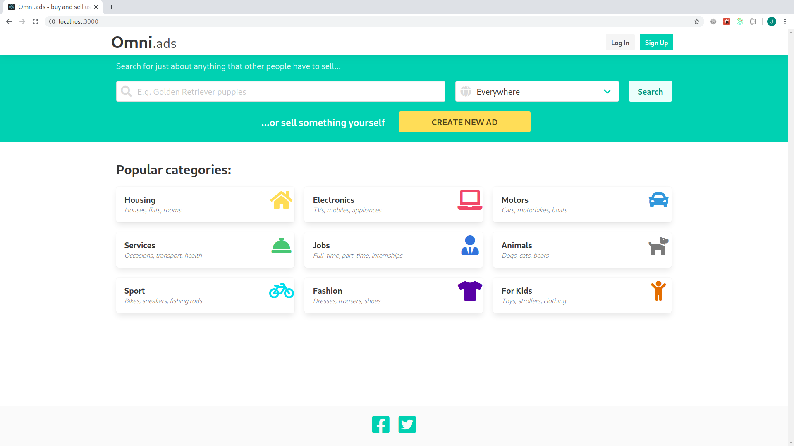
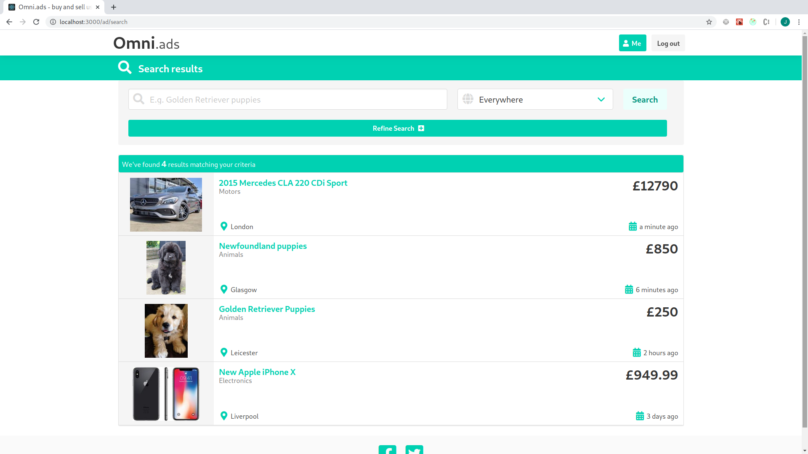
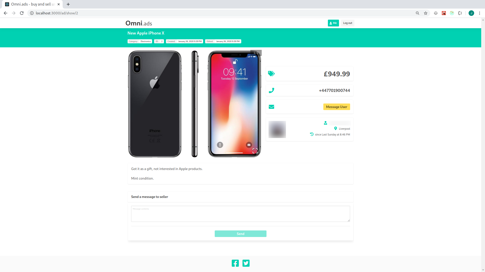
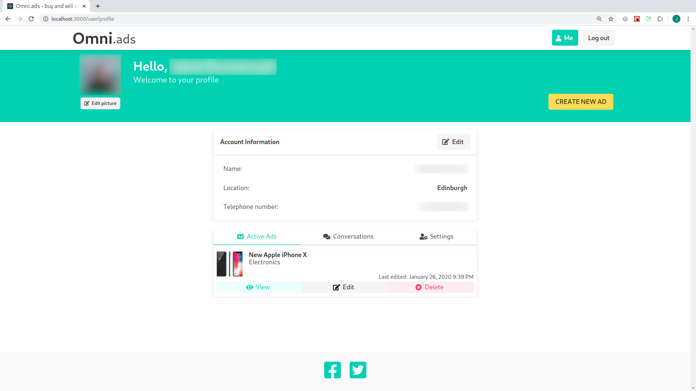

# Omni.ads  [](https://travis-ci.org/lorczyslav/Omni)
## About

Created web app allows for browsing, searching and creating adverts. Users are also presented with a dedicated messaging system, allowing for communication between parties. Application as a whole, was created using three-tier architecture which includes: user interface accessible via web browsers, REST API server and a database. Development included using technologies such as React and Django, along with Django REST Framework. In order to ensure proper operation, vast amount of unit tests was developed alongside the application.

## Requirements

- Docker
- NodeJS
- Yarn or npm

## Installation

1. Clone the repository and navigate to the project directory
```bash
git clone https://github.com/lorczyslav/Omni.git
cd Omni
```

2. Start docker
```bash
service docker start
```

3. Build the app
```bash
docker-compose build
```

4. Perform Django migration
```bash
docker-compose run --rm app sh -c "python manage.py migrate"
```

5. Populate DB with initial static data
```bash
docker-compose run --rm app sh -c "python manage.py loaddata initial_data.json"
```

6. Navigate to client app and install node modules
```bash
cd client
yarn install # or npm install
```
## Usage

To start the Django API app *(accessible at **localhost:8000**)*:
```bash
docker-compose up
```

To start the client app *(accessible at **localhost:3000**)*:
```bash
yarn start
```

To run the Django unit tests:
```bash
docker-compose run --rm app sh -c "python manage.py test"
```

## Troubleshooting

If you are using an ad-blocker, some requests might get blocked, reporting in browser's console as CORS errors. Simply disable adblocker for best experience.

## Screenshots

<p align="center"></p>
<p align="center"></p>
